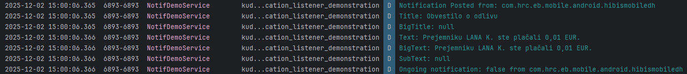
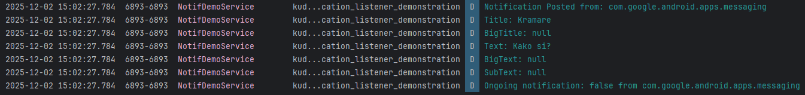

# Android NotificationListenerServiceDemo

## Kratek opis in razlog izbire

**NotificationListenerService** je Android storitev, ki omogoča aplikacijam, da spremljajo in upravljajo obvestila, ki jih ustvarjajo druge aplikacije na napravi.

Za predstavitev sem si jo izbral ker želim v našem projektu implementirati funkcionalnost, ki prebere kdaj je uporabnik prejel ali nekomu poslal denar, kar je najlažje dobiti tako, da preberemo obvestila iz aplikacij za plačevanje.

### Prednosti
- **Univerzalnost:** Možno je zajemati vsa sistemska in aplikacijska obvestila.
- **Prilagodljivost:** Razvijalci lahko prilagodijo, katere vrste obvestil želijo spremljati in kako naj se obdelujejo.
- **Dostop do podrobnih informacij:** Omogoča dostop do podrobnih informacij o obvestilih, kot so vsebina, čas prejema in izvorna aplikacija.
- **Nadzor nad obvestili:** Aplikacije lahko upravljajo obvestila, na primer jih brišejo ali spreminjajo njihovo vidnost.

### Slabosti
- **Zasebnost:** Potrebuje invazivna dovoljenja, ki jih mora uporabnik ročno odobriti, kar lahko odvrne uporabnike.
- **Poraba sistemskih virov:** Storitev mora biti stalno aktivna v ozadju, kar lahko (minimalno) vpliva na baterijo in procesiranje.
- **Omejitve dostopa do vsebine:** Nekatere informacije v obvestilih so lahko omejene zaradi varnostnih razlogov.

### Licenca
- NotificationListenerService je del Android operacijskega sistema, tako da spada pod **Android Open Source Project**, ki uporablja **Apache License 2.0**:
  - [Povezava do licence](https://source.android.com/license)

### Uporabnost in statistika
- **Uporabniki:** NotificationListenerService je razširjen na skoraj vseh Android napravah (tiste ki uprabljajo API v18 in novejši), kar pomeni da ga v neki obliki uporablja skoraj 4 milijarde uporabnikov.
- Število aplikacij, ki uporabljajo NotificationListenerService ni javno, ampak ga uporablja veliko aplikacij za produktivnost, varnost, nadzor in avtomatizacijo.

### Časovna in prostorska zahtevnost
- **Prostorska:** Tipična implementacija porabi le nekaj 10 KB v aplikaciji; poraba RAM je odvisna od količine zbranih podatkov.
- **Časovna:** Minimalna, porabi samo nekaj milisekund za prevajanje in nekaj milisekund za obdelavo vsakega dogodka.
- **Vpliv na baterijo:** Minimalen pri osnovnih funkcionalnostih.

### Vzdrževanje tehnologije
- **Število razvijalcev:** 10 do 20.
- **Zadnja sprememba:** Junija 2025, z izdajo Android 16, ki uporablja API v36.
- **Dokumentacija:** [Android Reference](https://developer.android.com/reference/android/service/notification/NotificationListenerService).

## Primer implementacije

Poleg prikazanega moramo najprej vprašati uporabnika za dovoljenje.
```kotlin
binding.settingsButton.setOnClickListener {
    val intent = Intent(Settings.ACTION_NOTIFICATION_LISTENER_SETTINGS)
    startActivity(intent)
}
```

1. Dodajanje dovoljenja v `AndroidManifest.xml`:
- Uporablja **System Binding**, potrebna implementacija "Foreground Service"
```xml
<service
        android:name=".services.NotificationListenerServiceDemo"
        android:label="@string/app_name"
        android:permission="android.permission.BIND_NOTIFICATION_LISTENER_SERVICE"
        android:exported="true">
  <intent-filter>
    <action android:name="android.service.notification.NotificationListenerService"/>
  </intent-filter>
</service>
```

2. Implementacija storitve:
```kotlin
class NotificationListenerServiceDemo : NotificationListenerService() {
  override fun onNotificationPosted(sbn: StatusBarNotification, rankingMap: RankingMap) {
    val notification: Notification = sbn.notification
    val extras: Bundle = notification.extras

    if (sbn.packageName !in acceptedPackages) {
      //cancelNotification(sbn.key)
      Log.d(TAG, "Notification that is not in acceptedPackages ignored automatically: ${sbn.packageName}")
      return
    }

    val title = extras.getString(Notification.EXTRA_TITLE)
    val bigTitle = extras.getCharSequence(Notification.EXTRA_TITLE_BIG)?.toString()
    val text = extras.getCharSequence(Notification.EXTRA_TEXT)?.toString()
    val bigText = extras.getCharSequence(Notification.EXTRA_BIG_TEXT)?.toString()
    val subText = extras.getCharSequence(Notification.EXTRA_SUB_TEXT)?.toString()

    Log.d(TAG, "Notification Posted from: ${sbn.packageName}")
    Log.d(TAG, "Title: $title")
    Log.d(TAG, "BigTitle: $bigTitle")
    Log.d(TAG, "Text: $text")
    Log.d(TAG, "BigText: $bigText")
    Log.d(TAG, "SubText: $subText")

    val ongoing = sbn.isOngoing
    Log.d(TAG, "Ongoing notification: $ongoing from ${sbn.packageName}")
  }
  override fun onNotificationRemoved(sbn: StatusBarNotification, rankingMap: RankingMap) {}
  override fun onNotificationRankingUpdate(rankingMap: RankingMap) {}
}
```

3. Primer izpisa:



## Demonstracija izjem

### Primeri izjem in njihovo reševanje

**1. NullPointerException**:
- Obvestilo lahko nima določenega polja (npr. naslov ali besedilo).
- Če ne preverimo, ali je vrnjena vrednost null, se nam lahko aplikacija pod določenimi pogoji zruši.
```kotlin
val title = extras.getString(Notification.EXTRA_TITLE) ?: "Brez naslova"
val text = extras.getCharSequence(Notification.EXTRA_TEXT)?.toString() ?: "Brez besedila"
```

**2. SecurityException**:
- Če uporabnik aplikaciji prekliče dovoljenje za dostop do obvestil, se pri določenih klicih lahko sproži izjema.
- Zato je priporočljivo dati takšne klice v try-catch.
```kotlin
try {
  cancelNotification(sbn.key)
} catch (e: SecurityException) {
  Log.e(TAG, "Ni dovoljenja za preklic obvestil!")
}
```

